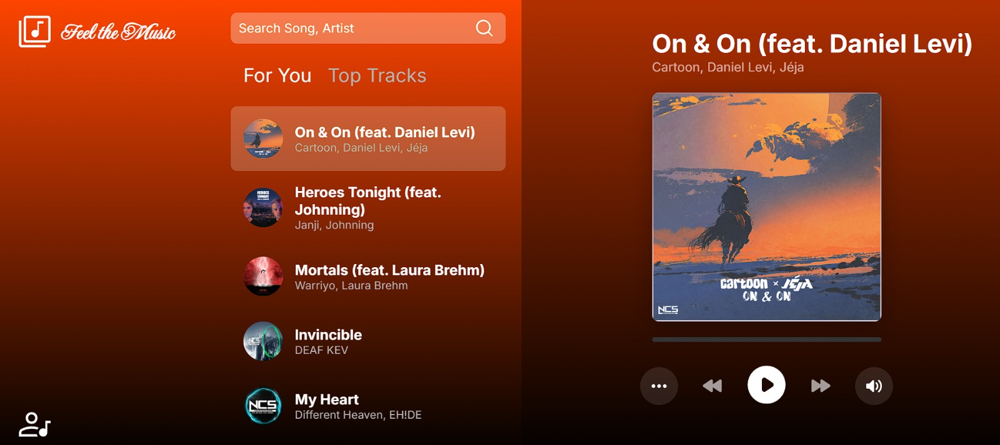

# `React Music Streaming Frontend: music-streaming-react-frontend`

This is a simple and interactive music player built using React. The music player fetches songs from an external API, provides functionalities such as play/pause, next/previous, search, and a tab switcher between "For You" and "Top Tracks". The player is responsive and includes a background gradient that changes according to the currently playing song's cover image.

## Features

- **Search**: Search songs by name or artist.
- **Music Control**: Play, pause, skip to next, or go to the previous track.
- **Seeker**: Seek to any part of the track using the slider.
- **Tab Change**: Switch between "For You" (top tracks) and "Top Tracks".
- **Responsive Design**: Mobile-friendly design with a menu button to show a list of songs.
- **Background Color Change**: Background gradient changes based on the song's cover image.
- **Persistent Playback**: Music continues to play even if the user navigates to another tab.

## Getting Started

### Prerequisites

- **Node.js** (version 12.x or later)
- **npm** or **yarn**

### Installation

1. Install dependencies:

   ```bash
   yarn install
   ```
2. Start the client (frontend):
   ```bash
   yarn start
   ```

### Running the Application

1. Start the development server:

   ```bash
   npm start
   ```

   or

   ```bash
   yarn start
   ```
2. Set the REACT_APP_SERVER_BASE_URL
```
REACT_APP_SERVER_BASE_URL=http://localhost:5000
```
If the server is not running, Application will use mock data

3. Open your browser and navigate to:

   ```
   http://localhost:3000
   ```

### Project Structure

```
react-music-player/
├── package.json
├── public/
│   ├── index.html
│   ├── mock_data
│   │   ├── covers
│   │   │   ├── 1.jpg
│   │   │   ├── 2.jpg
│   │   │   ├── [..].jpg
│   │   ├── songs
│   │   │   ├── 1.mp3
│   │   │   ├── 2.mp3
│   │   │   ├── [..].mp3
├── README.md
├── src/
│   ├── App.jsx
│   ├── App.module.css
│   ├── App.test.js
│   ├── assets/
│   ├── components/
│   │   ├── MusicPlayer.jsx
│   │   ├── Player.jsx
│   │   ├── SearchBar.jsx
│   │   ├── SongList.jsx
│   │   ├── styles/
│   │   │   ├── MusicPlayer.module.css
│   │   │   ├── Player.module.css
│   │   │   ├── SearchBar.module.css
│   │   │   ├── SongList.module.css
│   │   │   ├── TabSelector.module.css
│   │   ├── TabSelector.jsx
│   ├── index.css
│   ├── index.js
```

### MusicPlayer Component

The `MusicPlayer` component is the core of the application. It handles the following:

- Fetching song data from the Running Server.
- Managing the playback state (`isPlaying`, `currentSongIndex`, `currentTime`, `duration`).
- Handling user interactions like play/pause, song selection, and seeking.

### API Details

- The app fetches song data from (example if server is running on localhost:5000):

  ```
  http://localhost:5000/songs
  ```

- The response contains details such as `id`, `name`, `artist`, `accent` (for background color), `top_track`.

- MP3 song can be fetched using the following format:

  ```
  http://localhost:5000/song/1
  ```

- Cover images can be fetched using the following format:

  ```
  http://localhost:5000/cover/1
  ```

### Styling

- The app uses CSS modules for styling (`App.module.css` and `MusicPlayer.module.css`).
- The background color is dynamically changed based on the song's `accent` color.

### Custom Hooks & Logic

- **useEffect**: Multiple hooks are used to handle API calls, song changes, and UI updates.
- **useRef**: Used for the audio element to directly control the playback.

### Future Enhancements

- Add support for playlists.
- Implement more detailed audio visualizations.
- Improve accessibility features.

## License

This project is licensed under the MIT License. See the [LICENSE](LICENSE) file for details.

### Preview of the app



